# 추론 → 최종 제스처 판정 흐름

`firmware/exo_armband_hybrid/exo_armband_hybrid.ino` 기준. 코드에 있는 그대로를
다이어그램화한 것이며, **2026-08-26 리팩터를 반영한 현재 working tree 기준**이다
(HEAD `58fdfe1` 위에 아직 커밋 안 된 변경사항 — `git status`로 확인 가능).
값이 바뀌면 이 문서도 다시 그려야 한다 — 실제 값의 출처는 항상 `.ino` 파일이다.

> **이 리팩터로 바뀐 것**: REST 탈출 전용 다수결(`applyRestExitVote()`)과 close
> 전용 진폭 게이트(`closeStreak`/`CLOSE_CONFIRM_FRAMES`/`CLOSE_MIN_AVG_MARGIN_FACTOR`,
> 실패시 강제 REST)를 모두 제거했다. 이제 메커니즘은 **REST 게이트(입력단
> 디바운스) + 히스테리시스(margin+leaky-decay streak, 나머지 전부)** 두 가지뿐이고,
> REST→활성 전환과 close↔다른 클래스 전환도 전부 같은 히스테리시스를 탄다.
> 근거: close와 다른 클래스 간 feature 상관관계가 최대 0.59로 확인돼 별도 취급이
> 불필요하다고 판단. **안전 트레이드오프**: close 전용 게이트는 원래 "로봇손이
> 잘못 쥐는 것을 막는" 안전장치였다 — 제거했으니 실기기에서 close 오탐 빈도를
> 반드시 확인할 것.
>
> 참고로 `ROTATION_CONFIRM_FRAMES_BONUS=3`, `SUP_PRO_CONFIRM_FRAMES_BONUS=2`는
> 이번 리팩터로 바뀌지 않았다. Notion 문서(`로직 수정 v2`)는 이 리팩터 이전
> 버전(3-메커니즘 구조)을 기준으로 쓰여 있어 갱신이 필요하다.

핵심만 먼저 말하면: **REST만 채널 진폭 게이트를 통과(또는 강제)한 값이 즉시
확정**되고, 나머지 5클래스(flexion/extension/close/supination/pronation)
사이의 모든 전환 — REST에서 나가는 것까지 포함 — 은 **하나의 margin+leaky-decay
히스테리시스**로 처리된다.

---

## 전체 판정 흐름 (하나의 다이어그램)

```mermaid
flowchart TD
    subgraph S0["0. 입력 → 특징추출 → NN 추론"]
        A0["EMG 샘플링<br/>INFER_HOP=64 샘플마다 추론 트리거<br/>(WINDOW_SIZE=128, 50% overlap)"] --> B0["Preprocessor::process()<br/>bandpass(35–300Hz,4차) → rectify → envelope(kernel=12)<br/>→ classic(88)+TSD(44)=132차원 feature → standardize"]
        B0 --> C0["nn.predict(features, logits)"]
        C0 --> D0["nn.argmax(logits, 6)<br/>raw_pred = 결과"]
        B0 --> E0["computeChannelAmplitudes(snapshot, chAmp)"]

        NB0["📄 Preprocessor::process() — preprocessor.cpp:65<br/>bandpass→rectify→envelope→classic/TSD feature 추출→표준화를<br/>한 번에 실행하는 진입점 함수<br/>반환: 132차원 표준화 feature 벡터(out_features)"]:::note
        NC0["📄 NeuralNet::predict() — nn.h:40<br/>MLP 순전파. 마지막 layer activation=ACT_SOFTMAX(MODEL_ACTIVATIONS[2]=1)라<br/>출력이 이미 softmax 확률(합=1)임 — logits[]란 이름은 오해 소지 있음<br/>반환: logits[6] (클래스별 확률)"]:::note
        ND0["📄 NeuralNet::argmax() — nn.h:43<br/>확률벡터 중 최댓값 인덱스 반환 (길이 n=6)"]:::note
        NE0["📄 computeChannelAmplitudes() — :1747<br/>추론 윈도우(128샘플) 내 채널별 peak-to-peak(max−min) 계산<br/>8채널을 평균내지 않고 개별 반환 — 평균 내면 sup/pro처럼<br/>소수 채널만 강하게 반응하는 제스처가 희석되기 때문"]:::note

        B0 -.구현.-> NB0
        C0 -.구현.-> NC0
        D0 -.구현.-> ND0
        E0 -.구현.-> NE0
    end

    subgraph S1["1. REST 게이트 — 채널별 적응형 진폭 디바운스 (매 프레임 무조건 실행, runInference() 내부 인라인, 변경 없음)"]
        E0 --> F1{"chAmp[ch] >= floor[ch]×REST_MARGIN_FACTOR(4.0)?<br/>(8채널 각각 독립 판정)"}
        F1 -->|Yes 넘음| F2["loudStreak[ch]++<br/>(최대 LOUD_DEBOUNCE_FRAMES=2)"]
        F1 -->|No 안넘음| F3["loudStreak[ch]=0<br/>chQuiet[ch]=true"]
        F2 --> F4{"loudStreak[ch] >= 2 (연속)?"}
        F4 -->|Yes, 연속으로 넘음| F5["chQuiet[ch]=false<br/>(노이즈 스파이크 방어)"]
        F4 -->|No, 아직 1프레임뿐| F3
        F5 --> F6{"floor 갱신 게이트:<br/>직전 프레임 조용했음 OR<br/>FLOOR_STALE_TIMEOUT(60s) 경과?"}
        F3 --> F6
        F6 -->|Yes| F6a["updateChannelRestThreshold(ch, chAmp)"]
        F6 -->|No| F6b["floor 유지<br/>(제스처 지속중 오염 방지, self-lock 안전장치)"]
        F6a --> F7{"8채널 전부 chQuiet==true?<br/>(하나라도 false면 즉시 탈락)"}
        F6b --> F7
        F7 -->|Yes, 전부 조용| F8["isQuiet=true<br/>candidate_pred = REST<br/>(raw_pred 완전히 무시)"]
        F7 -->|No, 하나라도 시끄러움| F9["isQuiet=false<br/>candidate_pred = raw_pred<br/>(NN 예측 그대로 — close 포함 5클래스 중 무엇이든 나올 수 있음)"]

        NF6a["📄 updateChannelRestThreshold() — :1764<br/>채널 ch의 noise-floor(restFloorEstimate[ch])를 갱신하고<br/>그 시점 임계값(floor×REST_MARGIN_FACTOR)을 반환<br/>더 조용해지면 빠르게(FLOOR_DOWN_RATE=0.2) 따라가고,<br/>더 시끄러워지면 아주 천천히만(FLOOR_UP_RATE=0.002) 따라감"]:::note
        F6a -.구현.-> NF6a
    end
    D0 -.raw_pred 공급.-> F9

    subgraph S2["2. applyHysteresis(candidate_pred, logits) — :1694 (2026-08-26 단순화)"]
        F8 --> H1{"candidate_pred == REST?"}
        F9 --> H1
        H1 -->|Yes| H2["즉시확정: confirmed_pred = REST<br/>classStreak 전부 리셋<br/>━━ 유일한 bypass, 히스테리시스 미실행 ━━"]
        H1 -->|"No, 활성 5클래스<br/>(flexion/extension/close/supination/pronation)"| H3{"candidate_pred == confirmed_pred?"}
        H3 -->|Yes, 이미 같은 상태| H4["유지<br/>classStreak[candidate_pred]=0"]
        H3 -->|"No, 전환 시도<br/>(REST→활성 포함 전부 여기로)"| H5["③ leaky-decay 히스테리시스"]

        NH["📄 applyHysteresis() — :1694<br/>이제 분기가 REST bypass / 유지 / 히스테리시스 3가지뿐.<br/>2026-08-26 이전엔 CLOSE도 bypass였고, confirmed_pred==REST일 때<br/>별도 다수결(applyRestExitVote())로 빠졌었는데 둘 다 제거됨 —<br/>close와 다른 클래스 상관관계 최대 0.59로 확인돼 특별 취급 불필요 판단.<br/>REST만 예외인 이유: isQuiet 게이트가 raw_pred를 덮어써서 만든 값이라<br/>margin이 REST 자신의 확신도가 아니기 때문(아래 참고)<br/>반환: 그 프레임의 confirmed_pred (= final_pred)"]:::note
        H1 -.구현.-> NH
    end
    C0 -.logits 공급.-> H1

    subgraph S3["3. leaky-decay 히스테리시스 (REST→활성 전환 + 활성 클래스끼리 전환, 전부 이 하나로 처리)"]
        H5 --> J1["candidate_pred 이외 모든 클래스 i:<br/>classStreak[i] = max(0, streak[i]-STREAK_DECAY_STEP(1))<br/>(하드 리셋 아님)"]
        J1 --> J2["margin = top1(logits) - top2(logits)<br/>(이미 softmax된 확률 차이)"]
        J2 --> J3{"margin >= switchMarginFor(candidate_pred)?"}
        J3 -->|Yes, 충분히 우세| J4["classStreak[candidate_pred]++"]
        J3 -->|No, 애매함| J5["classStreak[candidate_pred] -= 1 (최소 0)"]
        J4 --> J6{"classStreak[candidate_pred] >= confirmFramesFor(candidate_pred)?"}
        J5 --> J6
        J6 -->|Yes| J7["confirmed_pred = candidate_pred<br/>streak 리셋 (전환 확정)"]
        J6 -->|No| J8["confirmed_pred 유지<br/>(직전 확정값, 순간 오분류 무시됨)"]

        K1{"switchMarginFor:<br/>candidate/confirmed 둘 다<br/>rotation군(ext/sup/pro)?"}
        K1 -->|Yes| K2["ROTATION_SWITCH_MARGIN<br/>(=SWITCH_MARGIN과 동일, 0.3)"]
        K1 -->|No| K3["SWITCH_MARGIN = 0.3"]
        K2 -.기준값 제공.-> J3
        K3 -.기준값 제공.-> J3

        L1{"confirmFramesFor:<br/>candidate/confirmed 둘 다<br/>sup/pro?"}
        L1 -->|Yes, 가장 엄격| L2["4+3+2 = 9프레임<br/>(~450ms)"]
        L1 -->|No| L3{"candidate/confirmed 둘 다<br/>rotation군?"}
        L3 -->|Yes| L4["4+3 = 7프레임<br/>(~350ms)"]
        L3 -->|"No, 나머지 전환<br/>(REST→활성, flexion 관련 등)"| L5["4프레임 (기본, ~200ms)"]
        L2 -.기준값 제공.-> J6
        L4 -.기준값 제공.-> J6
        L5 -.기준값 제공.-> J6

        NJ["📄 STREAK_DECAY_STEP leaky counter — :1708-1727<br/>별도 함수 아님, applyHysteresis() 본문 인라인<br/>조건 불충족 프레임에도 streak를 0으로 밀지 않고 1씩만 깎음<br/>(하드 리셋의 취약점 — 노이즈 한 프레임에 전체 진행이 날아가는<br/>문제를 2026-08-25 실기기 검증 후 이 방식으로 교체)"]:::note
        NK1["📄 switchMarginFor() — :1662<br/>candidate/confirmed가 둘 다 rotation군이면 ROTATION_SWITCH_MARGIN,<br/>아니면 SWITCH_MARGIN 반환. 현재 두 값이 같아 사실상 공통 기준"]:::note
        NL1["📄 confirmFramesFor() — :1649<br/>candidate/confirmed 조합을 isSupOrPro()/isRotationFamily()로 검사해<br/>필요 연속 프레임 수를 3단계(4/7/9)로 반환<br/>— 코랩 분석에서 확인된 혼동 그룹일수록 더 까다롭게.<br/>이 로직 자체는 2026-08-26 리팩터로 바뀌지 않음"]:::note
        NM["📄 isRotationFamily() — c ∈ {extension,supination,pronation}<br/>📄 isSupOrPro() — c ∈ {supination,pronation}<br/>둘 다 순수 predicate 함수, 상태 변경 없음"]:::note

        J1 -.구현.-> NJ
        K1 -.구현.-> NK1
        L1 -.구현.-> NL1
        L1 -.내부에서 호출.-> NM
    end

    subgraph S4["4. 출력"]
        H2 --> N1["confirmed_pred = final_pred"]
        H4 --> N1
        J7 --> N1
        J8 --> N1
        N1 --> N2["Serial 로그<br/>t=, final_pred, raw_pred, quiet, logits[6]"]
        N1 --> N3{"mode?"}
        N3 -->|MODE_SLAVE| N4["BLE notify → 폰 앱<br/>'classname&#124;l0&#124;l1&#124;l2&#124;l3&#124;l4&#124;l5'"]
        N3 -->|MODE_MASTER| N5["MARK7로 클래스 인덱스 전송<br/>(handState==HAND_READY 일 때만)"]
    end

    classDef note fill:#fffbe6,stroke:#e0b400,stroke-width:1px,color:#3a2e00,text-align:left,font-size:12px;
```

> **표시 규칙**: 실선(`-->`)은 실제 제어 흐름/데이터 전달, 점선(`-.->`)은 두 종류로 쓰였다 —
> ① 📄 로 시작하는 **노란 노트 노드**로 가는 점선은 "이 처리가 실제로 어떤 함수에
> 구현돼 있는지"를 가리키고, ② 그 외 점선(`raw_pred 공급`, `logits 공급`,
> `기준값 제공`)은 다른 값이 판정 조건에 입력으로 쓰인다는 뜻이다.

---

## 실행 조건 요약

| 실행되는 것 | 조건 |
|---|---|
| 디바운스 (항상 실행) | `LOUD_DEBOUNCE_FRAMES` 채널별 진폭 — 조건 없음, 매 프레임 8채널 전부 |
| 즉시 확정 (bypass) | `candidate_pred == REST` — 유일한 예외 |
| 유지 (no-op) | `candidate_pred == confirmed_pred` |
| **leaky-decay 히스테리시스** | 그 외 전부 — REST→활성 전환, close↔다른 활성 클래스 전환, 활성 클래스끼리 전환 |

`isRotationFamily(c)`: `c ∈ {extension, supination, pronation}` (코랩 분석에서
서로 자주 헷갈리는 것으로 확인된 축). `isSupOrPro(c)`: `c ∈ {supination, pronation}`
(이 둘끼리가 rotation 계열 중에서도 특히 더 자주 오락가락한다는 실기기 피드백으로
추가 분리됨). close는 이 두 predicate 어디에도 속하지 않으므로 항상
`CONFIRM_FRAMES_DEFAULT(4)`/`SWITCH_MARGIN(0.3)` 기본값을 받는다.

---

## 상수 값 요약 (현재 working tree 기준)

| 상수 | 값 | 위치 |
|---|---|---|
| `N_CHANNEL` | 8 | preprocessor.h:7 |
| `WINDOW_SIZE` / `INFER_HOP` | 128 / 64 (50% overlap) | :507-508 |
| `N_CLASSES` | 6 (rest,flexion,extension,close,supination,pronation) | :507,509 |
| `REST_MARGIN_FACTOR` | 4.0 | :633 |
| `LOUD_DEBOUNCE_FRAMES` | 2 | :672 |
| `FLOOR_DOWN_RATE` / `FLOOR_UP_RATE` | 0.2 / 0.002 | :631-632 |
| `FLOOR_STALE_TIMEOUT_MS` | 60000 | :660 |
| `CONFIRM_FRAMES_DEFAULT` | 4 | :546 |
| `SWITCH_MARGIN` | 0.3 | :547 |
| `ROTATION_SWITCH_MARGIN` | `SWITCH_MARGIN`과 동일(0.3) | :556 |
| `ROTATION_CONFIRM_FRAMES_BONUS` | 3 | :571 |
| `SUP_PRO_CONFIRM_FRAMES_BONUS` | 2 | :580 |
| `STREAK_DECAY_STEP` | 1 | :590 |

**제거된 상수** (2026-08-26): `CLOSE_CONFIRM_FRAMES`, `CLOSE_MIN_AVG_MARGIN_FACTOR`,
`REST_EXIT_VOTE_N`, `REST_EXIT_VOTE_THRESHOLD` — 더 이상 코드에 없음.

---

## 짚어둘 만한 엣지케이스

1. **REST는 여전히 두 가지 경로로 나올 수 있다** — ① 8채널 전부 조용해서 강제된
   REST, ② NN이 시끄러운 상황에서도 raw_pred로 직접 REST를 예측한 경우. 둘 다
   `applyHysteresis()` 안에서는 구분 없이 즉시 확정되며, 진행 중이던 다른
   클래스의 `classStreak`를 전부 0으로 날린다. ②는 디바운스를 전혀 거치지 않는
   경로라는 점에서 잠재적 취약점 (변경 없음).
2. **close 안전장치 제거됨 — 실기기 검증 필요** — close 오분류가 로봇손을
   잘못 쥐게 만드는 것을 막기 위한 전용 게이트(진폭 조건 + 실패시 강제 REST)가
   사라졌다. 이제 close도 다른 활성 클래스와 똑같이 4프레임 연속 + margin 0.3만
   만족하면 확정된다. 실기기에서 오탐 빈도가 늘어나는지 반드시 확인.
3. **REST→활성 전환이 다수결에서 히스테리시스로 회귀** — 예전에 다수결로 뺐던
   이유가 "REST 탈출 초반은 노이즈 비중이 높아 decay가 잘 안 쌓인다"는 것이었다.
   이 문제가 재발할 가능성이 있으니 `[HYST]` 로그로 REST 탈출 구간의
   margin/streak 분포를 확인할 것.
4. **메커니즘이 하나로 줄어든 만큼 히스테리시스 파라미터의 영향 범위가 커졌다** —
   `CONFIRM_FRAMES_DEFAULT`/`SWITCH_MARGIN`/`STREAK_DECAY_STEP`을 조정하면 이제
   REST 탈출과 close 확정에도 동시에 영향을 준다 (예전엔 서로 분리된 파라미터였음).
